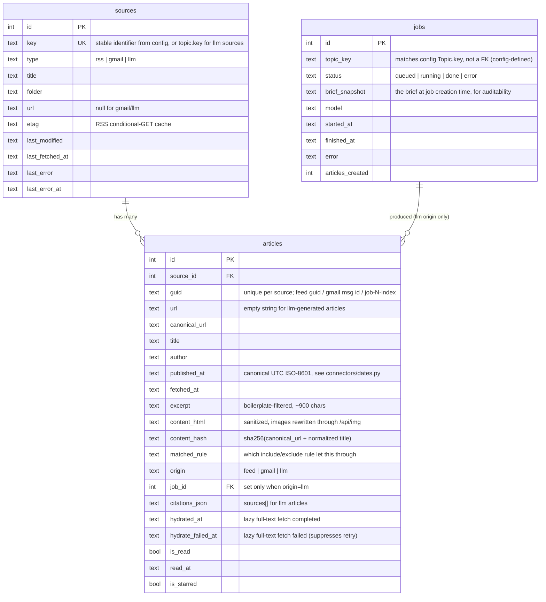

# OpenReader — Technical Design & ERD

Status: reflects the app as built (2026-08-12). Companion to `docs/PRD.md`.

## 1. Architecture overview

```
┌─────────────────────────┐        ┌──────────────────────────────────┐
│  Frontend (React/Vite)   │  HTTP  │  Backend (Starlette, Python)      │
│  3-pane UI, dark/light,  │◄──────►│  Sync request handlers only —     │
│  responsive drawer        │  /api  │  no request ever does network     │
└─────────────────────────┘        │  I/O except /api/refresh, /api/img │
                                    │  and /api/topics/:key/generate     │
                                    └──────────────┬─────────────────────┘
                                                    │
                        ┌───────────────────────────┼───────────────────────────┐
                        ▼                           ▼                           ▼
              ┌──────────────────┐       ┌──────────────────┐        ┌──────────────────────┐
              │ RSS connector     │       │ Gmail connector   │        │ Generation worker      │
              │ httpx + defusedxml│       │ REST + OAuth       │        │ out-of-process,        │
              │ conditional GET   │       │ refresh token       │        │ spawned via subprocess │
              └──────────────────┘       └──────────────────┘        │ runs `claude` CLI       │
                        │                           │                └──────────────────────┘
                        └───────────────┬───────────┘                           │
                                        ▼                                        ▼
                              ┌────────────────────┐                  ┌──────────────────┐
                              │  Ingest pipeline     │                  │  jobs table        │
                              │  rules → dedup →     │                  │  (status tracking) │
                              │  persist              │                  └──────────────────┘
                              └────────────────────┘
                                        │
                                        ▼
                              ┌────────────────────┐
                              │  SQLite (WAL)        │
                              │  sources / articles / │
                              │  jobs                 │
                              └────────────────────┘
```

Key architectural rule: **the request path never blocks on external I/O**
except the three endpoints that are inherently about triggering external
work (`/api/refresh`, `/api/img`, `/api/topics/:key/generate`). Everything
else — article list, sources, config, job status — is a local SQLite read.

## 2. Backend module map

```
backend/app/
├── main.py            # Starlette app factory, route table
├── asgi.py             # production entrypoint (uvicorn app.asgi:app)
├── settings.py         # env-driven paths (DB, config, media, gmail token)
├── config.py            # msgspec Config/Source/Rule/Topic structs,
│                        # YAML parse+validate+serialize (to_yaml)
├── db.py                # schema (see §3), WAL connection factory
├── store.py             # read/write helpers used by the API layer
├── connectors/
│   ├── base.py           # NormalizedEntry — the shape every connector emits
│   ├── rss.py             # Atom/RSS2.0/RDF parser (defusedxml)
│   ├── dates.py           # RFC822 + ISO8601 -> canonical UTC ISO string
│   ├── http_fetch.py       # conditional-GET wrapper (ETag/Last-Modified)
│   └── gmail.py             # Gmail REST client + MIME parser
├── ingest/
│   ├── rules.py             # regex include/exclude engine (pure)
│   ├── dedup.py              # URL canonicalization + content hash (pure)
│   ├── textutil.py            # excerpt extraction, sanitize, image-proxy rewrite
│   ├── extract.py             # readability heuristic + relative->absolute URLs
│   ├── hydrate.py              # lazy per-article full-text fetch (once, ever)
│   └── refresh.py               # orchestrates one sync refresh pass
├── generate/
│   ├── prompt.py                 # system prompt + JSON schema for the model
│   ├── client.py                  # `claude` CLI subprocess wrapper
│   ├── jobs.py                     # SQLite job status transitions
│   └── worker.py                    # out-of-process job runner (__main__)
└── api/
    ├── sources.py, articles.py, refresh_api.py, config_api.py,
    │ images.py, generate_api.py   # thin Starlette handlers over the above
```

Design rule followed throughout: **pure logic is separated from I/O** and
every I/O boundary (HTTP fetch, subprocess call, Gmail API) is injectable
in tests via a `Fetcher`/`Runner`/`GenerateFn`-style callable parameter, so
the entire pipeline is unit-tested without a real network call or
subprocess spawn. 136 backend tests, zero of which touch the network.

## 3. Data model (ERD)



Notes on choices that aren't obvious from the columns alone:

- **`UNIQUE(source_id, guid)`** on `articles` is the entire dedup
  mechanism for re-ingestion: a refresh that sees the same guid again is a
  no-op insert, which is also what makes refresh idempotent and cheap to
  run repeatedly.
- **LLM-generated articles get a real row in `sources`** (`type='llm'`,
  keyed by the topic's `key`), created on first generation. This means
  generated content reuses the exact same list/folder/unread-count
  machinery as RSS/Gmail sources for free — no parallel data path in the
  API or frontend for "generated" content.
- **`content_hash`** is *not* currently used for cross-source duplicate
  detection (e.g. the same story from two outlets) — it's indexed for a
  future dedup pass but the only active dedup key today is `(source_id,
  guid)`.
- **`published_at` is always normalized to UTC ISO-8601** at ingest time
  (`connectors/dates.py`), specifically because RSS 2.0's RFC822 dates
  (`Tue, 11 Aug 2026 05:30:24 +0000`) and Atom's ISO-8601 dates sort
  incorrectly against each other as raw strings — this was a real bug
  found and fixed mid-build (see WORKLOG).

## 4. API surface

| Method & path | Purpose | Blocking I/O? |
|---|---|---|
| `GET /api/sources` | List sources with unread counts | No |
| `POST /api/sources` | Structured add-source (validates, writes YAML, creates DB row) | No |
| `GET /api/articles` | List articles (`view=all\|unread\|starred`, `source_id`, `folder`) | No |
| `GET /api/articles/:id` | Article detail; triggers lazy full-text hydration if applicable | **Yes** (one-time per article) |
| `POST /api/articles/:id/read` | Mark read (idempotent, one-directional) | No |
| `POST /api/articles/:id/toggle-read` | Manual read/unread toggle | No |
| `POST /api/articles/:id/star` | Toggle starred | No |
| `POST /api/refresh` | Synchronous refresh (`?source=key` for one) | **Yes** |
| `GET/PUT /api/config` | Read/write `feeds.yaml` (validates on write) | No |
| `GET /api/img` | Image proxy (strips Referer, sidesteps hotlink protection) | **Yes** |
| `GET /api/topics` | List configured topics + `llm.enabled` flag | No |
| `POST /api/topics/:key/generate` | Create a job, spawn worker subprocess, return immediately | No (spawn is fire-and-forget) |
| `GET /api/jobs/:id` | Poll job status | No |

## 5. Key technical decisions (and why)

**Synchronous, manual refresh — no scheduler.** Simpler to reason about
and test; the per-source report (`fetched/new/filtered/error`) is the
thing that actually matters when tuning regex rules, and you only get that
naturally from a synchronous, on-demand call.

**Lazy, per-article full-text extraction, not a background hydration
pass.** Bandwidth and CPU are spent only on the ~10% of articles actually
opened. `hydrated_at`/`hydrate_failed_at` make it a strict once-ever
operation with a hard 5s timeout that falls back to the feed's own
summary rather than erroring.

**Image proxy (`/api/img`) is mandatory, not optional.** Several real
feeds (dapenti.com/xilei, discovered mid-build) hotlink-protect their
images on `Referer` — a direct `` from our own origin gets
silently blocked. Routing every image through the server sidesteps that
and also avoids leaking the reader's IP/referrer to third-party hosts on
every article view.

**`claude` CLI subprocess, not the Anthropic API.** Generation runs
against the user's Claude subscription via OAuth (keychain), not
`ANTHROPIC_API_KEY`. Two invariants protect that: never pass `--bare`
(its own docs: under `--bare`, OAuth/keychain are never read — only
`ANTHROPIC_API_KEY`), and the API key is explicitly scrubbed from the
child environment regardless.

**`--permission-mode bypassPermissions`, not `dontAsk`.** Found live,
mid-build: `dontAsk` silently *denies* every WebSearch/WebFetch call in
headless mode — the run completes successfully with zero real research
done, which is a dangerous silent-failure shape (you'd get a job marked
"done" with 0 articles and no obvious reason why). `bypassPermissions`
actually lets the two tools `--tools` already restricts the model to
run. Locked in with a regression test
(`test_build_command_uses_bypass_permissions_not_dont_ask`).

**Generated articles carry hard provenance.** `origin='llm'`, a visible
"Generated by Claude" badge, a mandatory Sources block with real citation
URLs, and the exact brief snapshot stored on the job row — because
synthesized text sitting next to real reporting is easy to misread later,
and the stored brief is what lets you debug a topic producing bad output.

**Dependency minimalism.** Deliberately avoided FastAPI/pydantic
(Starlette + msgspec instead), feedparser (stdlib `defusedxml.ElementTree`
+ a ~150-line normalizer instead), and the Google API client library
(raw REST over httpx instead) — each swap was chosen to keep the idle
resident footprint small for a service meant to run indefinitely on a
personal machine. `google-auth-oauthlib` is scoped to an optional
dependency group (`--extra gmail-auth`) and imported only by the one-time
auth script, never by the server.

## 6. Testing strategy

- **Unit, no network/subprocess**: every connector, the rules engine,
  dedup, date normalization, the readability extractor, the image proxy
  rewriter, and the `claude` CLI wrapper are tested via injected
  fetch/runner functions against fixtures. 147 tests as of this writing —
  see `docs/WORKLOG.md` for what each new round added.
- **Live verification for the pieces that can't be meaningfully faked**:
  real RSS feeds (including a CJK-language, hotlink-protected, non-UTF8
  one), real Chrome browser sessions (desktop + mobile viewport), and one
  real `claude` CLI generation run — which is what surfaced the
  `bypassPermissions` bug no unit test could have caught, since it's a
  property of the real CLI's headless permission handling.
- **No automated frontend test suite yet** (see PRD open questions) —
  frontend changes were verified via `tsc --noEmit`, `vite build`, and
  live browser testing per change.

## 7. Deployment / local operation

- Backend: `uv run uvicorn app.asgi:app --host 0.0.0.0 --port 8787` (LAN-
  reachable by default; `READER_CONFIG`/`READER_DB` env vars override
  paths).
- Frontend dev: `npm run dev` (Vite, also bound to `0.0.0.0`, proxies
  `/api` to `127.0.0.1:8787`). Production build (`npm run build`) is
  served directly by the backend via `StaticFiles` when `frontend/dist`
  exists.
- Gmail: one-time `uv run --extra gmail-auth python scripts/gmail_auth.py`
  after placing a Google Cloud OAuth client secret at
  `config/gmail_client_secret.json` (gitignored). Writes
  `data/token.json` (gitignored); the server reads it at refresh time and
  never touches it otherwise.
